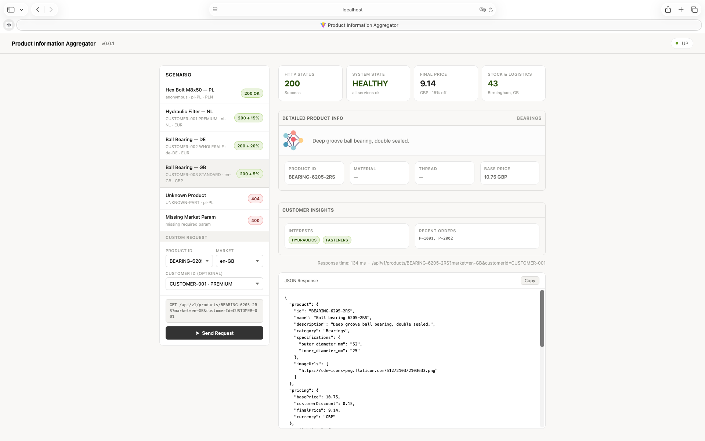

# Product Information Aggregator

This project is a resilient Spring Boot service that aggregates product data from multiple upstream domains - **Catalog**, **Pricing**, **Availability**, and **Customer** - into a single, market-aware response. 



## How to Run

**Prerequisites:** Java 21+, Maven 3.8+, Docker Desktop

```bash
git clone https://github.com/AndrzejSzelag/product-information-aggregator.git
cd product-information-aggregator
mvn clean package -DskipTests
java -jar target/product-information-aggregator-0.0.1-SNAPSHOT.jar
```

The service starts on **http://localhost:8080**.

**Run with Docker**

```bash
docker-compose up --build
```

**Web UI**
A built-in testing dashboard is available at **http://localhost:8080**. It supports preset scenarios and custom requests with real-time JSON responses.

**Example curl Requests**

```bash
# Anonymous request (pl-PL, PLN)
curl "http://localhost:8080/api/v1/products/BOLT-M8-50?market=pl-PL"

# Premium customer with discount (nl-NL, EUR)
curl "http://localhost:8080/api/v1/products/FILTER-HYD-001?market=nl-NL&customerId=CUSTOMER-001"

# Wholesale customer (de-DE, EUR)
curl "http://localhost:8080/api/v1/products/BEARING-6205-2RS?market=de-DE&customerId=CUSTOMER-002"

# Product not found → 404
curl "http://localhost:8080/api/v1/products/UNKNOWN-PART?market=en-GB"

# Missing required param → 400
curl "http://localhost:8080/api/v1/products/BOLT-M8-50"
```

### Health Check
```bash
curl http://localhost:8080/actuator/health
```

### Run Tests
```bash
mvn test
```

### Test Data

| Product ID         | Category    |
|--------------------|-------------|
| `BOLT-M8-50`       | Fasteners   |
| `FILTER-HYD-001`   | Filtration  |
| `BEARING-6205-2RS` | Bearings    |

| Customer ID     | Segment   | Discount |
|-----------------|-----------|----------|
| `CUSTOMER-001`  | PREMIUM   | 15%      |
| `CUSTOMER-002`  | WHOLESALE | 20%      |
| `CUSTOMER-003`  | STANDARD  | 5%       |

| Market Code | Currency |
|-------------|----------|
| `nl-NL`     | EUR      |
| `de-DE`     | EUR      |
| `pl-PL`     | PLN      |
| `en-GB`     | GBP      |

## Key Design Decisions
 
### 1. Parallel Execution — Virtual Threads (Java 21)
 
The three optional upstream calls (Pricing, Availability, Customer) are dispatched concurrently via `CompletableFuture.supplyAsync()` on a `VirtualThreadPerTaskExecutor`. The mandatory Catalog call runs on the calling thread first, blocking only if the catalog itself is unavailable.
 
**Why Virtual Threads over a fixed thread pool?**
Upstream calls are pure I/O — the thread is idle while waiting for a response. Virtual threads are scheduled by the JVM, not the OS, so thousands can be parked cheaply. There is no pool to size, no risk of thread starvation, and no queue to tune. Total response latency converges to `max(individual latencies)` rather than their sum.
 
**Why not `CompletableFuture.allOf()`?**
`allOf` propagates the first exception and cancels the pipeline. Partial failures are a first-class requirement here, so each future is collected individually via a `collect()` helper that catches `CompletionException` and wraps the result in a `PartialResult<T>` value object — either a success with a non-null value, or a failure with a reason string.
 
### 2. Hard vs. Soft Dependencies
 
| Service | Dependency type | Failure behavior |
|---|---|---|
| `CatalogService` | **Hard** | Exception propagates → `GlobalExceptionHandler` → 503 |
| `PricingService` | Soft | `pricing: null`, `pricingAvailable: false` |
| `AvailabilityService` | Soft | `availability: null`, `availabilityAvailable: false` |
| `CustomerService` | Soft | Skipped entirely if `customerId` is absent; otherwise degrades gracefully |
 
The `dataAvailability` block in every response gives the frontend precise, field-level degradation signals — not just a generic "something failed" flag. This enables smart UI placeholders without the client guessing.
 
### 3. Interface-Driven Design
 
Every upstream service is represented by a Java interface (`CatalogService`, `PricingService`, etc.). `AggregatorService` depends only on those interfaces — it has no knowledge of mocks, HTTP clients, or gRPC stubs. Replacing a mock with a real implementation means creating one class that implements the interface and registering it as a Spring bean. `AggregatorService` requires zero changes.
 
### 4. Immutable Data Model — Java Records
 
All DTOs (`ProductCatalog`, `ProductPricing`, `AggregatedProductResponse`, etc.) are Java Records. Records are immutable by definition, which is critical when the same object may be read concurrently by multiple threads after a `CompletableFuture` join. There is no defensive copying, no synchronization, and no risk of partial writes.
 
### 5. Realistic Mock Behavior
 
Mocks extend `AbstractMockService`, which injects:
 
- **Jitter**: actual latency = `typicalLatency ± 25%`, randomized per call. This causes futures to complete in non-deterministic order, surfacing any race conditions in the aggregation logic.
- **Failure injection**: a single `random.nextDouble()` check against the configured reliability threshold. At 98% reliability, 2 in 100 calls throw a `RuntimeException`, exercising the degradation path on every extended test run.
 
| Mock | Latency | Reliability |
|---|---|---|
| `MockCatalogService` | 50ms | 99.9% |
| `MockPricingService` | 80ms | 99.5% |
| `MockAvailabilityService` | 100ms | 98.0% |
| `MockCustomerService` | 60ms | 99.0% |
 
### 6. Testability Without Real Threads
 
`AggregatorService` exposes a package-private constructor that accepts an `ExecutorService`. Unit tests inject a `SameThreadExecutor` — a minimal `AbstractExecutorService` that runs every task synchronously on the calling thread. This makes `CompletableFuture.supplyAsync()` behave as a direct call, giving deterministic, fast tests without `Thread.sleep()` or `await()` hacks.
 
### 7. Docker — Multi-Stage Build
 
```
Stage 1 (maven:3.9.6-eclipse-temurin-21-alpine)  ~500 MB  →  compile + package
Stage 2 (eclipse-temurin:21-jre-alpine)            ~90 MB  →  copy .jar only
```
 
The final image contains no Maven, no source code, and no JDK — only the JRE and the application jar. The application runs under a non-root `spring` user. Spring Boot Actuator exposes `/actuator/health` for Docker Compose health checks.
 
**JVM flags:** `-XX:+UseZGC -XX:+ZGenerational` enables Generational ZGC, the recommended GC for Java 21 Virtual Thread workloads. It handles the high churn of short-lived objects produced by concurrent upstream calls with sub-millisecond pause times.
 
---
 
## What I Would Do Differently With More Time
 
**Timeouts and Circuit Breakers**
Every `CompletableFuture` should have `.orTimeout(200, TimeUnit.MILLISECONDS)` to cap worst-case latency. Beyond that, Resilience4j Circuit Breakers would prevent repeatedly calling a service that is clearly down — after N consecutive failures, the breaker opens and the aggregator returns a cached or degraded result immediately, saving resources and reducing tail latency.
 
**Caching**
Product catalog data (name, description, specs) changes on the order of hours or days. A short TTL cache (Caffeine for in-process, Redis for multi-instance) would eliminate redundant catalog calls and reduce p99 latency significantly. Pricing and availability data would use shorter TTLs or bypass the cache entirely.
 
**Contract Testing**
With Pact or Spring Cloud Contract, each mock would generate a published contract. CI would verify that any change to the upstream service's schema is caught before it reaches production — not after.
 
**Structured Logging and Tracing**
Each request should carry a correlation ID propagated through all async futures. Combined with structured JSON logs and a distributed trace (OpenTelemetry → Tempo or Jaeger), this makes degraded responses debuggable across services.
 
**Metrics**
Micrometer counters per service (success / failure / timeout) exposed via `/actuator/prometheus` would make the reliability percentages visible in Grafana and allow alerting on degradation rate spikes.
 
---
 
## Design Question: Flash Sales
 
**How to handle prices changing every few minutes?**
 
**1. Real-time priority over caching**
For flash-sale products, the aggregator must bypass any price cache and fetch live. The cleanest signal is an event: the Pricing team publishes a Kafka message (`PriceChangedEvent { productId, validFrom, validUntil }`) and the aggregator evicts that product's price entry immediately. This avoids polling and keeps cache TTLs long for normal products while ensuring flash-sale prices are always fresh.
 
**2. Expiry metadata in the response**
Add a `validUntil: Instant` field to `ProductPricing`. The frontend can render a live countdown ("Offer ends in 02:45") without polling the backend. When the countdown expires, the client re-fetches once — a controlled, predictable spike instead of a thundering herd.
 
**3. Thundering herd protection**
When a flash sale starts and thousands of users hit the same product simultaneously, only one request should reach the upstream Pricing service. A Cache Aside with request coalescing (one thread fetches, others wait on the same future) ensures the upstream sees a single call per cache miss. Caffeine supports this natively with `AsyncLoadingCache`. For multi-instance deployments, a Redis lock or a Singleflight pattern at the gateway level achieves the same effect.
 
**4. Model the "price window" explicitly**
A `FlashPriceContext { originalPrice, flashPrice, startsAt, endsAt }` type makes the temporary nature of the price a first-class concept in the domain model, rather than a runtime flag. This prevents the aggregator from caching a flash price beyond its `endsAt` window by accident.
